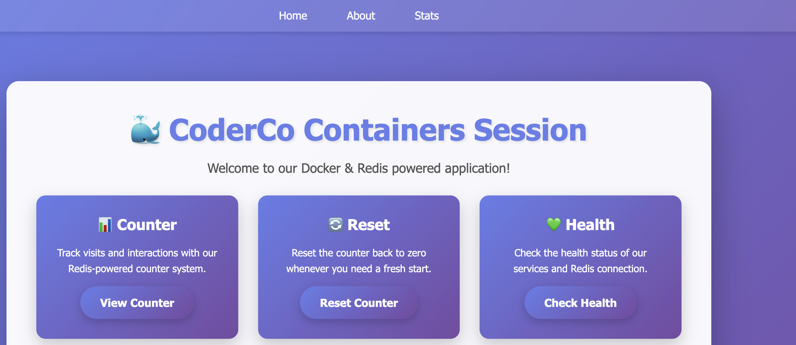
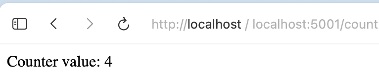
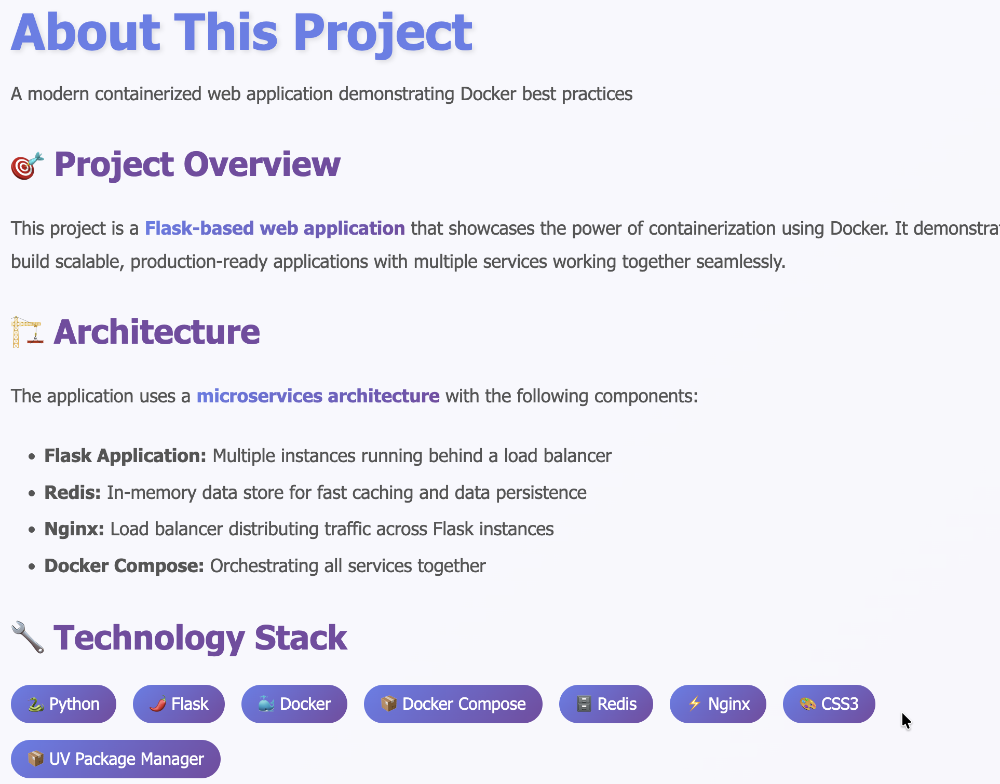
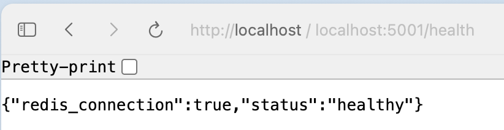
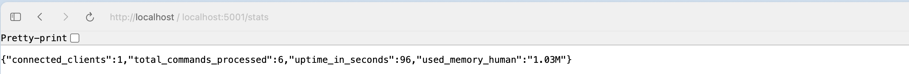

# CoderCo Containers Challenge

## Building a Multi-Container Application

## Objective

Create a multi-container application that consists of a simple Python Flask web application and a Redis database. The Flask application uses Redis to store and retrieve data. The application exposes several routes that demonstrate different endpoints of the Flask application.

## Requirements

### Flask Web Application

A Flask app that exposes the following routes:

- `/` - Displays a welcome message.
- `/about` - Displays an about page.
- `/count` - Increments and displays a visit count stored in Redis.
- `/reset` - Resets the visit counter to zero.
- `/health` - Returns a JSON health check including the Redis connection status.
- `/store` (POST) - Stores a key/value pair in Redis.
- `/retrieve/<key>` - Retrieves a stored value by key.
- `/stats` - Returns Redis server statistics.

### Redis Database

Use Redis as a key-value store to keep track of the visit count and store user-supplied values.

### Dockerise Both Services

- Create a Dockerfile for the Flask app.
- Use the official Redis image.
- Use Docker Compose to orchestrate the multi-container application.

## Project Structure

```
.
├── app.py
├── Dockerfile
├── redis-docker-compose.yaml
├── requirements.txt
├── images/
├── static/
└── templates/
```

## Getting Started

Build and start the application with Docker Compose:

```bash
docker compose -f redis-docker-compose.yaml up --build
```

The Flask app is available at `http://localhost:5001`.

## Screenshots

### Home Page



### Count Page



### About Page



### Health Check



### Stats



## Bonus

### Scaling the Application

Scale the Flask service to run multiple instances and load balance between them using Docker Compose:

```bash
docker compose -f redis-docker-compose.yaml up --build --scale flask-app=3
```
